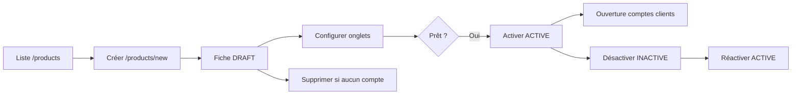

# Guide utilisateur — Catalogue de produits

**Application** : Tableau de bord Core Banking (back-office)  
**Module** : Catalogue de produits  
**Public** : Utilisateurs opérations, produits, conformité, comptabilité  
**Version du guide** : 1.0 — juin 2026  
**URL d’accès** : `http://localhost:3000/products` (ou l’URL de votre environnement)

**Spécification technique** (cas d’utilisation, règles de gestion détaillées) : [specification-module-catalogue-produits.md](../../core_banking_backend/doc/specification-module-catalogue-produits.md) — sections 3 et 4.

---

## 1. Objectif du module

Le **catalogue de produits** permet de définir et maintenir l’offre bancaire proposée aux clients : comptes, dépôts, prêts, etc. Chaque produit regroupe :

- son **identité** (code, nom, catégorie, devise, statut) ;
- sa **tarification** (taux, frais, limites, pénalités) ;
- ses **règles métier** (éligibilité, durées, moyens de paiement) ;
- son **raccordement comptable** (mappings vers le grand livre / PCEMF).

Les comptes clients ouverts dans le système sont **toujours rattachés à un produit actif**. Une configuration incomplète ou incorrecte bloque l’ouverture de compte, les transactions ou la comptabilisation.

---

## 2. Accès et navigation

### 2.1 Menu

Dans la barre latérale du back-office, ouvrez **Catalogue de produits** (icône colis / package).

| Écran | Chemin | Rôle |
|-------|--------|------|
| Liste | `/products` | Consulter, filtrer, accéder aux fiches |
| Nouveau produit | `/products/new` | Créer un produit (statut initial : brouillon) |
| Fiche produit | `/products/{id}` | Configurer et gérer le cycle de vie |

### 2.2 Prérequis

- Être **connecté** au tableau de bord avec un compte disposant des droits back-office (canal OPS).
- Pour les mappings comptables : le **plan comptable** et les **comptes GL** doivent déjà exister (menu *Grand livre* / *Comptes GL*).
- Pour les moyens de paiement : le **catalogue des moyens de paiement** doit être renseigné avant de les associer à un produit.

> **Documentation technique liée (équipe projet)**  
> - Périmètre produits EMF : `core_banking_backend/doc/emf/perimetre-produits-categorie-emf-cat2.md`  
> - Seed produits illustratif : `core_banking_backend/doc/emf/seed_produits_emf_cat2_xaf.sql`  
> - Plan comptable PCEMF : `core_banking_backend/doc/grand Livre/plan-comptable-pcemf-emf.md`

---

## 3. Vue d’ensemble du parcours

**Ordre recommandé de configuration** (avant activation) :

1. Vue d’ensemble — vérifier identité et soldes min/max  
2. Taux d’intérêt  
3. Périodes *(DAT, prêts)*  
4. Frais  
5. Limites  
6. Pénalités  
7. Règles d’éligibilité  
8. Moyens de paiement  
9. Mappings grand livre  

---

## 4. Liste des produits (`/products`)

### 4.1 En-tête

- **Actualiser** : recharge la liste depuis le serveur.  
- **Nouveau produit** : ouvre le formulaire de création.

### 4.2 Cartes statistiques

| Carte | Signification |
|-------|----------------|
| **Total** | Nombre total de produits en base (toutes pages confondues) |
| **Actifs** | Produits en statut `ACTIVE` sur la **page affichée** |
| **Brouillons** | Produits `DRAFT` sur la page affichée |
| **Inactifs** | Produits `INACTIVE` sur la page affichée |

> Les cartes Actifs / Brouillons / Inactifs reflètent la page courante lorsque la pagination affiche moins d’éléments que le total. La carte **Total** correspond toujours au nombre global.

### 4.3 Filtres

| Filtre | Effet |
|--------|--------|
| **Recherche** | Filtre local sur nom, code ou description (sans nouvel appel serveur) |
| **Statut** | `Tous`, `Actif`, `Brouillon`, `Inactif` — réinitialise la pagination |
| **Catégorie** | Filtre serveur par type de produit |

### 4.4 Tableau

Colonnes : **Code**, **Nom** (lien vers la fiche), **Catégorie**, **Statut**, **Devise**, **Taux d’intérêt** (taux par défaut ou « - »), **Actions** (bouton *Voir*).

### 4.5 Pagination

En bas du tableau : choix du nombre d’éléments par page (10, 20, 50, 100) et navigation entre les pages.

---

## 5. Créer un produit (`/products/new`)

### 5.1 Informations de base

| Champ | Obligatoire | Description |
|-------|-------------|-------------|
| **Code** | Oui | Identifiant unique métier (ex. `EMF-COURANT`). Non modifiable ensuite. |
| **Catégorie** | Oui | Type de produit (voir § 6). |
| **Nom** | Oui | Libellé affiché aux utilisateurs. |
| **Description** | Non | Texte d’aide / notice produit. |

### 5.2 Paramètres financiers

| Champ | Description |
|-------|-------------|
| **Devise** | Code ISO 3 lettres (défaut `XAF`). |
| **Solde minimum** | Plancher de solde autorisé sur le produit (si applicable). |
| **Solde maximum** | Plafond de solde. |
| **Taux d’intérêt par défaut (%)** | Taux de référence affiché ; les grilles détaillées se configurent ensuite dans l’onglet *Taux d’intérêt*. |

### 5.3 À la validation

- Le produit est créé en statut **Brouillon** (`DRAFT`).  
- Vous êtes redirigé vers la **fiche produit** pour compléter la configuration.  
- Erreurs fréquentes : code déjà utilisé, nom ou code vide.

---

## 6. Catégories de produits

| Catégorie (SI) | Libellé interface | Usage typique |
|----------------|-------------------|---------------|
| `CURRENT_ACCOUNT` | Compte courant | Compte à vue, dépôts/retraits courants |
| `SAVINGS_ACCOUNT` | Compte épargne | Épargne rémunérée |
| `TERM_DEPOSIT` | Dépôt à terme (DAT) | Placement bloqué à échéance |
| `LOAN` | Prêt | Crédit amortissable (demandes, décaissement, remboursements) |
| `CARD` | Carte | Carte liée à un compte *(hors périmètre EMF V1 standard)* |

### Périmètre EMF 2ᵉ catégorie (V1)

Pour une microfinance CEMAC hors réseau, le périmètre fonctionnel initial comprend **quatre produits** :

| Code seed (exemple) | Produit |
|---------------------|---------|
| `EMF-COURANT` | Compte courant à vue |
| `EMF-EPARGNE` | Compte épargne livret |
| `EMF-DAT` | Dépôt à terme bloqué |
| `EMF-PRET-MICRO` | Crédit microfinance amortissable |

---

## 7. Cycle de vie et statuts

| Statut | Libellé | Signification |
|--------|---------|---------------|
| `DRAFT` | Brouillon | Produit en cours de définition ; **non** utilisable pour ouvrir de nouveaux comptes |
| `ACTIVE` | Actif | Produit commercialisable |
| `INACTIVE` | Inactif | Produit retiré de la commercialisation ; les comptes existants peuvent subsister selon les règles métier |

### Actions disponibles sur la fiche

| Action | Condition | Effet |
|--------|-----------|-------|
| **Activer** | Statut `DRAFT` ou `INACTIVE` | Passe à `ACTIVE` |
| **Désactiver** | Statut `ACTIVE` | Passe à `INACTIVE` |
| **Supprimer** | Aucun compte client ouvert sur ce produit | Supprime le produit **et** toutes ses configurations (taux, frais, limites, etc.) |

> **Important** : vous ne pouvez pas supprimer un produit si au moins un **compte client** y est rattaché. Fermez d’abord les comptes concernés.

Le **code** et la **catégorie** ne sont pas modifiables depuis la vue d’ensemble (évite les incohérences comptables et contractuelles).

---

## 8. Fiche produit — onglets de configuration

Chaque onglet affiche un compteur `(n)` du nombre d’éléments configurés. Utilisez **Actualiser** en haut de page si vous venez de modifier des données dans un autre onglet.

---

### 8.1 Vue d’ensemble

**Contenu affiché**

- Cartes récapitulatives : identité, statut, devise, soldes min/max, taux par défaut, description.  
- Compteurs des configurations (taux, frais, limites, etc.).

**Modification**

1. Cliquez sur **Modifier**.  
2. Ajustez nom, description, statut, devise, soldes, taux par défaut.  
3. **Enregistrer** ou **Annuler**.

**Contraintes métier**

- Solde minimum ≤ solde maximum.  
- Taux entre 0 % et 100 %.  
- Devise sur 3 caractères.

---

### 8.2 Taux d’intérêt

Définit les grilles de taux selon le type d’opération et les tranches.

| Champ clé | Description |
|-----------|-------------|
| **Type de taux** | `Dépôt`, `Prêt`, `Pénalité` |
| **Valeur (%)** | Taux nominal |
| **Montant min / max** | Tranche de montant concernée |
| **Période min / max (jours)** | Tranche de durée (DAT, prêts) |
| **Méthode de calcul** | Simple, Composé, Variable |
| **Fréquence de capitalisation** | Quotidien, Mensuel, Trimestriel, Annuel *(si composé)* |
| **Dates d’effet** | Début obligatoire ; fin optionnelle |
| **Actif** | Permet de désactiver une ligne sans la supprimer |

**Actions** : ajouter, consulter (œil), modifier, supprimer (avec confirmation).

**Exemples métier**

- Épargne : plusieurs paliers selon le solde (2,5 % / 3 % / 3,5 %).  
- DAT : taux croissants selon la durée (3, 6, 12, 24 mois).  
- Prêt : taux `LENDING` par tranche de montant et durée.

---

### 8.3 Frais

Définit les commissions et frais facturés sur le produit.

| Champ clé | Description |
|-----------|-------------|
| **Type de frais** | Ouverture, Mensuel, Annuel, Transaction, Retrait, Carte, Autre |
| **Type de transaction** | Optionnel — vide = tous types |
| **Nom** | Libellé facture / relevé |
| **Base de calcul** | Fixe, Solde, Montant transaction, Solde impayé |
| **Montant fixe / Pourcentage** | Selon la base |
| **Min / Max frais** | Bornes du montant calculé |
| **Devise** | Doit être cohérente avec le produit (`XAF`) |
| **Dispensable** | Indique si une dérogation manuelle est possible |
| **Actif / Dates d’effet** | Période de validité |

**Bonnes pratiques**

- Pour un frais **mensuel** ou **annuel** actif, évitez les chevauchements de dates : désactivez l’ancienne ligne avant d’en créer une nouvelle.  
- Frais en **% du montant** : renseignez le pourcentage ; base `Fixe` = montant forfaitaire uniquement.

---

### 8.4 Limites

Contrôle les montants et agrégats autorisés.

| Type de limite | Usage |
|----------------|--------|
| Solde minimum / maximum | Encours ou solde compte |
| Transaction min / max | Par opération |
| Montant min / max de dépôt | Spécifique DAT / dépôts |
| Montant min / max de crédit | Encours prêt |
| Limite quotidienne / hebdomadaire / mensuelle / annuelle | Agrégats par période |
| Limite de retrait / carte | Opérations ciblées |

| Champ | Description |
|-------|-------------|
| **Type de transaction** | Ex. `WITHDRAWAL`, `DEPOSIT`, ou tous |
| **Valeur** | Montant ou plafond |
| **Période** | Transaction, Quotidien, Mensuel, À vie, etc. |
| **Dates d’effet** | Validité de la règle |

Les limites actives sont contrôlées lors des **dépôts, retraits et virements** sur les comptes du produit.

---

### 8.5 Périodes

Indispensable pour les **dépôts à terme** et les **prêts** (durées proposées à l’ouverture ou à la demande de crédit).

| Champ | Description |
|-------|-------------|
| **Nom** | Ex. « 12 mois » |
| **Durée (jours / mois / ans)** | Au moins les jours sont requis |
| **Taux d’intérêt (%)** | Taux associé à cette durée |
| **Montant min / max** | Montant autorisé pour cette durée |
| **Ordre d’affichage** | Tri dans les listes de choix client |
| **Actif** | Disponibilité commerciale |

---

### 8.6 Pénalités

Sanctions ou indemnités en cas d’événement contractuel.

| Type | Exemple |
|------|---------|
| Retrait anticipé | Rupture DAT avant échéance |
| Retard de paiement | Échéance prêt impayée |
| Violation solde minimum | Épargne sous le seuil |
| Prépaiement | Remboursement anticipé de prêt |
| Découvert, Autre | Selon politique interne |

Paramètres : base de calcul (fixe, % du principal, des intérêts, etc.), montants min/max, **période de grâce** (jours), dates d’effet.

---

### 8.7 Éligibilité

Règles vérifiées à l’**ouverture de compte** ou à la **demande de prêt**.

| Type de règle | Exemple |
|---------------|---------|
| Âge minimum / maximum | ≥ 18 ans pour courant, ≥ 21 ans pour prêt |
| Statut client | `VERIFIED` (KYC validé) |
| Score de risque | ≤ 70 |
| Flag PEP | Exclusion personne politiquement exposée |
| Solde minimum | Premier versement DAT ≥ 50 000 XAF |

| Champ | Description |
|-------|-------------|
| **Opérateur** | Égal, Supérieur ou égal, Dans la liste, etc. |
| **Type de données** | Nombre, Texte, Booléen, Date, Énumération |
| **Valeur** | Seuil ou liste (`IN` : valeurs séparées par des virgules) |
| **Obligatoire** | Si non satisfaite, l’opération est refusée |
| **Message d’erreur** | Texte affiché à l’utilisateur |

---

### 8.8 Moyens de paiement

Associe le produit aux **canaux** de dépôt, retrait ou remboursement de prêt définis dans le catalogue global des moyens de paiement.

| Option | Description |
|--------|-------------|
| **Dépôt** | Autorise les versements via ce moyen |
| **Retrait** | Autorise les retraits |
| **Remboursement prêt** | Autorise le paiement d’échéances de prêt |

**Procédure**

1. **Ajouter un moyen** → choisir un moyen actif non encore lié.  
2. Cocher au moins une des trois options.  
3. Définir l’**ordre d’affichage**.  
4. Enregistrer.

Vous pouvez **modifier les options** ou **retirer** le lien (sans supprimer le moyen du catalogue global).

---

### 8.9 Grand livre (mappings GL)

Relie le produit aux **comptes du grand livre** pour la comptabilisation automatique (passif client, intérêts, frais, actif prêt, etc.).

| Type de mapping | Rôle comptable |
|-----------------|----------------|
| **Compte passif** (`LIABILITY_ACCOUNT`) | Encours clients (courant, épargne, DAT) |
| **Compte actif** (`ASSET_ACCOUNT`) | Créances / prêts |
| **Compte intérêts** (`INTEREST_ACCOUNT`) | Charges ou produits d’intérêts |
| **Compte frais** (`FEE_ACCOUNT`) | Commissions |
| **Compte revenus / charges** | Autres écritures selon modèle |

**Règles**

- Un seul mapping par **type** et par produit.  
- Le compte GL choisi doit être **actif** et de **nature comptable compatible** (ex. passif pour `LIABILITY_ACCOUNT`).  
- Sans mapping passif (ou actif pour un prêt), les transactions ne pourront pas générer d’écritures correctes.

**Référence EMF (exemples de codes GL seed)**

| Produit | Mapping principal | Code GL type |
|---------|-------------------|--------------|
| Courant | Passif | `GL-CURRENT-PASSIF-XAF` |
| Épargne | Passif | `GL-SAVINGS-PASSIF-XAF` |
| DAT | Passif | `GL-TERM-DEPOSIT-PASSIF-XAF` |
| Prêt | Actif | `GL-LOAN-CONSO-CT-XAF` |

---

## 9. Impacts sur les autres modules

| Module | Lien avec le produit |
|--------|----------------------|
| **Comptes clients** (`/accounts`) | Choix du produit à l’ouverture ; doit être `ACTIVE` |
| **Clients** | Éligibilité KYC / âge / risque |
| **Prêts** | Produit catégorie `LOAN` + périodes + taux `LENDING` |
| **Transactions / Virements** | Frais, limites, moyens de paiement |
| **Grand livre** | Mappings et comptes GL |
| **Plan comptable** | Codes PCEMF des comptes GL |

---

## 10. Bonnes pratiques

1. **Travailler en brouillon** jusqu’à configuration complète, puis **activer** une seule fois.  
2. **Tester** sur un produit de recette avant de modifier un produit en production.  
3. **Documenter** le code produit (convention `EMF-…` ou interne).  
4. **Aligner** devise, mappings GL et frais sur la même devise (`XAF`).  
5. **Vérifier les dates d’effet** : une date future rend la règle invisible jusqu’à ce jour.  
6. Après import SQL (seed), contrôler la fiche de chaque produit dans l’interface (onglets et compteurs).  
7. Ne pas supprimer un produit référencé par des comptes : préférer **désactiver**.

---

## 11. Messages d’erreur fréquents

| Message (ou sens) | Cause probable | Action |
|-------------------|----------------|--------|
| Code produit déjà existant | Doublon de `code` | Choisir un autre code |
| Impossible de supprimer : comptes ouverts | Comptes rattachés | Désactiver ou fermer les comptes |
| Seuls DRAFT ou INACTIVE peuvent être activés | Statut incorrect | Vérifier le statut actuel |
| Seuls ACTIVE peuvent être désactivés | Idem | — |
| Client doit être VERIFIED | Règle d’éligibilité | Finaliser le KYC client |
| Produit doit être ACTIVE | Ouverture compte | Activer le produit |
| Mapping de ce type existe déjà | Doublon GL | Modifier ou supprimer l’ancien mapping |
| Erreur d’accès aux données | Problème technique base / enum | Contacter l’administrateur ; vérifier les logs serveur |
| Au moins une option dépôt/retrait/prêt | Moyens de paiement | Cocher au moins un drapeau |

---

## 12. FAQ

**Pourquoi le total de la liste affiche 0 alors que je vois des produits ?**  
Cela indique un problème d’interprétation de la pagination côté interface ; actualisez la page ou signalez l’incident (le total serveur doit correspondre au nombre réel de produits).

**Puis-je changer la catégorie d’un produit existant ?**  
Non depuis l’interface : la catégorie est figée à la création.

**Un produit INACTIVE bloque-t-il les comptes existants ?**  
Il empêche en général de **nouvelles** souscriptions ; le traitement des comptes déjà ouverts dépend des règles opérationnelles de votre établissement.

**Faut-il configurer les périodes pour un compte courant ?**  
Non, sauf besoin métier spécifique. En revanche, **DAT** et **prêts** nécessitent des périodes.

**Où sont gérés les moyens de paiement eux-mêmes (espèces, mobile money, etc.) ?**  
Dans le catalogue global des moyens de paiement ; l’onglet produit ne fait que l’**association** et les autorisations.

---

## 13. Synthèse des écrans

| Étape | Où cliquer | Résultat attendu |
|-------|------------|------------------|
| Voir l’offre | Menu → Catalogue de produits | Liste + statistiques |
| Créer | Nouveau produit | Brouillon + fiche |
| Configurer | Onglets de la fiche | Compteurs > 0 selon besoin |
| Mettre en production | Activer | Statut Actif |
| Retirer de la vente | Désactiver | Statut Inactif |
| Contrôle comptable | Onglet Grand livre | Mappings passif/actif + frais + intérêts |

---

## 14. Historique du document

| Version | Date | Modifications |
|---------|------|---------------|
| 1.0 | 03/06/2026 | Création initiale — parcours interface `/products` |

---

*Document généré pour le tableau de bord Core Banking. Pour toute évolution fonctionnelle, se référer au code source des écrans `src/app/products/` et aux spécifications EMF du dépôt backend.*
